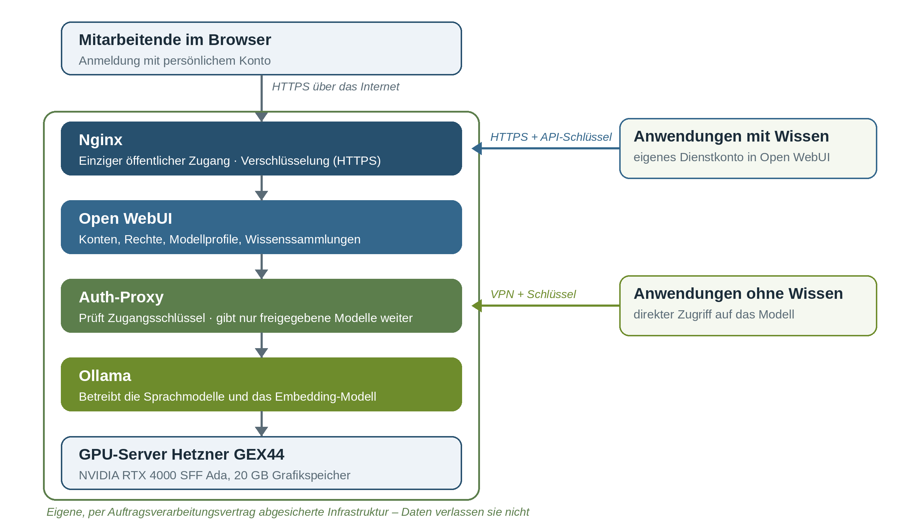

# 4 Wie ist der tatsächliche Stand im September 2026?

Der Zeitplan ist eingehalten. Phase 1 ist abgeschlossen, Phase 2 weitgehend. Ein Baustein aus Phase 3 wurde vorgezogen, weil ein konkreter Bedarf entstand.

| Baustein laut Planung | Stand September 2026 |
|---|---|
| Sichere Infrastruktur | **Erreicht.** Gemieteter GPU-Server mit Auftragsverarbeitungsvertrag in Betrieb; zusätzlich ein Testzugang bei einem Dienstleister |
| Frei verfügbare Modelle | **Erreicht.** Mehrere offene Modelle laufen auf dem eigenen Server |
| Praxistest und Vergleich mit kommerziellen Modellen | **Erreicht.** Test zur Korrektur von Rechtsbehelfsbelehrungen; behebes-Test durchgeführt |
| Wissensdatenbank | **Erreicht.** Sammlung Verwaltungsrecht mit 414 Dokumenten eingebunden |
| Schutzmechanismen und Rechte | **Weitgehend erreicht.** Technische Absicherung in Betrieb; Modellprofile je Zielgruppe auf einem Testsystem erprobt, Übertragung folgt |
| MCP-Server | **Offen.** Vor Projektstart mit Cloud-Modellen erprobt; Anbindung an den eigenen Server folgt |
| Testanwendergruppe | **Begonnen.** Einzelne Kolleginnen und Kollegen testen punktuell; der Start mit fester Gruppe folgt |
| Servergröße und Wirtschaftlichkeit | **Weitgehend erreicht.** Kosten und Kapazität des eigenen Servers liegen vor; Kostendaten des Dienstleister-Modells folgen |
| Wissensablage (aus Phase 3) | **Vorgezogen.** Eigenes Wiki mit Anmeldung im Einsatz; Anleitungen aus Notizen der Sachbearbeitung erzeugt, fachlich abgenommen und von Auszubildenden erfolgreich genutzt |

## 4.1 Die Lösung im Überblick

Das Bild zeigt, wie die Lösung aufgebaut ist. Alle Bausteine laufen auf dem gemieteten Server, für den ein Auftragsverarbeitungsvertrag besteht.

| Baustein | Was er tut | Warum das wichtig ist |
|---|---|---|
| **Nginx** | Nimmt Anfragen aus dem Internet entgegen und verschlüsselt die Verbindung | Der einzige Weg von außen auf den Server; alles andere ist nicht erreichbar |
| **Open WebUI** | Oberfläche für die Mitarbeitenden und Schnittstelle für Fachanwendungen; verwaltet Konten, Rechte, Modellprofile und Wissenssammlungen | Hier wird festgelegt, wer welches Modell mit welchem Wissen nutzen darf – für Personen und Anwendungen gleichermaßen |
| **Auth-Proxy** | Selbst entwickelter „Türsteher“ vor den Sprachmodellen | Fachanwendungen ohne Zugriff auf Wissenssammlungen kommen nur mit Schlüssel und über ein privates Netz (VPN) direkt an die Modelle; Verwaltungsbefehle sind gesperrt |
| **Ollama** | Betreibt die Sprachmodelle und das Modell für die Wissensdatenbank | Die Modelle laufen vollständig auf dem eigenen Server |
| **GPU-Server** | Rechenleistung: Hetzner GEX44 mit Grafikkarte NVIDIA RTX 4000 SFF Ada (20 GB Speicher) | Der Grafikspeicher bestimmt, welche Modelle laufen können |

Alle eingesetzten Programme sind Open Source. Versionsstände: Debian 13 als Betriebssystem, Ollama 0.34, Open WebUI 0.11.

> **Reproduzierbar:** Die hier beschriebene Serverlösung lässt sich mit dem GitHub-Repository [Verbandsgemeinde-Otterbach-Otterberg/ki-onpremise](https://github.com/Verbandsgemeinde-Otterbach-Otterberg/ki-onpremise) auf einem eigenen Server nachbauen. Die Installationsskripte sind dort vollständig veröffentlicht; eine Übersicht steht in Kapitel 5.12. Die vorgezogene Wissensablage (Kapitel 4.8) folgt mit dem Abschlussbericht.

## 4.2 Sprachmodelle

Auf dem Server stehen mehrere frei verfügbare Modelle bereit. Wegen des begrenzten Grafikspeichers ist jeweils ein größeres Modell aktiv; es kann bei Bedarf gewechselt werden.

| Modell | Größe | Einsatz | Getestet? |
|---|---|---|---|
| Gemma 4 26B-A4B (Google) | 25 Mrd. Parameter | Hauptmodell; versteht auch Bilder | ✅ **getestet** (Kapitel 4.6) |
| Llama 3.2 3B (Meta) | 3,2 Mrd. Parameter | kleines, schnelles Vergleichsmodell | ✅ **getestet** (Kapitel 4.6) |
| Qwen3 30B-A3B (Alibaba) | 30 Mrd. Parameter | verfügbar | ❌ nicht getestet |
| Mistral Small 3.1 (Mistral AI) | 24 Mrd. Parameter | verfügbar | ❌ nicht getestet |
| Llama 3.1 8B (Meta) | 8 Mrd. Parameter | verfügbar | ❌ nicht getestet |
| Phi-4 mini (Microsoft) | 3,8 Mrd. Parameter | verfügbar | ❌ nicht getestet |
| nomic-embed-text | 137 Mio. Parameter | übersetzt Dokumente für die Wissensdatenbank | ⚙️ im Betrieb, kein Vergleichstest |
| ~~Qwen3-14B (Alibaba)~~ | 14 Mrd. Parameter | nicht mehr verfügbar; durch Gemma 4 überholt | ✅ **getestet** (Kapitel 4.6) |

**Getestet** heißt: Das Modell hat den Praxistest zur Korrektur von Rechtsbehelfsbelehrungen mit 100 Anfragen durchlaufen (Kapitel 4.6 und 5.10). **Nicht getestet** heißt: Das Modell ist installiert und lauffähig, seine fachliche Eignung ist aber noch nicht bewertet; diese Modelle sollten vorerst nur zum Ausprobieren und nicht für die Sacharbeit genutzt werden. Qwen3-14B wurde in Stufe 1 getestet, ist auf dem heutigen Server aber nicht mehr installiert. Gemma 4 hat es in allen Kennzahlen deutlich übertroffen (Kapitel 4.6), deshalb wird es nicht wieder eingerichtet. Seine Ergebnisse lassen sich nicht auf das größere Qwen3 30B-A3B übertragen.

Zwei Eigenschaften machen Gemma 4 für den Server besonders geeignet. Das Modell liegt in einer komprimierten Fassung vor, die deutlich weniger Speicher braucht und nur wenig Qualität kostet (Fachbegriff: Quantisierung). Außerdem ist es nach dem Prinzip „Mixture of Experts“ aufgebaut: Für jedes Wort wird nur ein Teil des Modells (rund 4 Mrd. Parameter) aktiv, deshalb antwortet es schnell. Gemma 4 belegt rund 14,8 GB des Grafikspeichers und läuft vollständig auf der Grafikkarte.

Jedes Modell kann bis zu 16.384 Token auf einmal verarbeiten; ein Token ist ein Wortbestandteil. Das entspricht rund 20 Seiten Text, genug für Anfrage, Quellen aus der Wissensdatenbank und Antwort zusammen.

## 4.3 Wissensdatenbank

In Open WebUI ist eine Wissenssammlung **Verwaltungsrecht** mit 414 Dokumenten angelegt: Bundesrecht (u. a. GG, VwVfG, VwGO) und Landesrecht Rheinland-Pfalz (u. a. GemHVO, LBKG, KAG, POG sowie Produkt- und Kontenrahmenplan Doppik). Hinzu kommt eine Sammlung mit der Gemeindeordnung Rheinland-Pfalz.

Die Dokumente sind in rund 28.600 Abschnitte zerlegt. Jeder Abschnitt wird in eine Zahlenreihe übersetzt, die seine Bedeutung abbildet (Fachbegriff: Embedding). So findet das System zu einer Frage die inhaltlich passenden Stellen, auch wenn andere Wörter verwendet werden. Auch diese Übersetzung läuft auf dem eigenen Server.

## 4.4 Zugang, Rechte und Schutzmechanismen

| Ebene | Umsetzung |
|---|---|
| Netz | Von außen ist nur die verschlüsselte Weboberfläche erreichbar, dazu ein Wartungszugang für die IT. Die Sprachmodelle selbst sind von außen nicht erreichbar. |
| Konten | Neue Konten sind zunächst gesperrt und werden von der Administration freigeschaltet. |
| Fachanwendungen | Es gibt zwei Wege. **Anwendungen, die Wissen aus der Datenbank brauchen,** greifen über die Schnittstelle von Open WebUI zu: mit eigenem Dienstkonto und API-Schlüssel und damit genau mit den Rechten der Gruppe, der das Konto zugeordnet ist. **Anwendungen ohne Wissensbedarf** greifen direkt über den Auth-Proxy zu: mit Schlüssel, über ein privates Netz (VPN) und ohne die Möglichkeit, Modelle zu laden oder zu löschen. Einzelheiten in Kapitel 6.2. |
| Modellfreigabe | Der Auth-Proxy gibt nur das jeweils freigegebene Modell weiter. |
| Protokollierung | Protokolliert werden Zeitpunkt, Art der Anfrage, Modell und Ergebnis, aber keine Inhalte. |
| Zielgruppen | Modellprofile je Zielgruppe – mit eigener Arbeitsanweisung an das Modell und eigener Wissenssammlung, nur für eine Benutzergruppe sichtbar – wurden auf einem separaten Testsystem erprobt, u. a. im Austausch mit einem Dienstleister. Auf dem produktiven Server ist zunächst ein Profil eingerichtet; die Übertragung folgt mit dem Ausbau der Testgruppe. |

Fachlich gilt der Grundsatz: Die KI liefert Entwürfe, die Entscheidung trifft das Fachpersonal.

## 4.5 Zweites Betriebsmodell: Testzugang bei einem Dienstleister

Neben dem eigenen Server stand ein Testzugang bei Orgasoft Kommunal (OSK) zur Verfügung. Dort lief ein deutlich größerer Server mit 128 GB Grafikspeicher und den Modellen Llama, Qwen, Mistral und BakLLaVA, angesprochen direkt über die Programmierschnittstelle ohne Oberfläche. Anders als auf dem eigenen Server konnten mehrere Modelle gleichzeitig laufen. Die Zusammenarbeit bestand aus zwei gemeinsamen Terminen als experimenteller Austausch auf Arbeitsebene.

Für diesen Testzugang bestand kein Auftragsverarbeitungsvertrag. Dort wurden deshalb ausschließlich anonymisierte bzw. nicht-personenbezogene Daten verarbeitet. Die Wirtschaftlichkeit dieses Betriebsmodells wird ausgewertet, sobald die Kostendaten vorliegen.

## 4.6 Ergebnisse des Modellvergleichs

**Korrektur von Rechtsbehelfsbelehrungen.** Jedes Modell erhielt 100 Anfragen mit zwei fehlerhaften Rechtsbehelfsbelehrungen und demselben Prüfauftrag. Von Hand bewertet wurde, ob der Fehler erkannt bzw. beseitigt wurde und ob am Ende eine vollständig korrekte Belehrung stand. Die Methode steht in Kapitel 5.10.

| Modell | Betrieb | Fehler erkannt bzw. beseitigt | Korrektes Ergebnis |
|---|---|---|---|
| Llama 3.2 3B | eigener Server | 38 % | 17 % |
| Qwen3-14B | eigener Server | 76 % | 62 % |
| Gemma 4 26B-A4B | eigener Server | 97 % | 96 % |
| Kommerzielle Cloud-Modelle (GPT-5.6, Claude) | Cloud-Dienst | 100 % | 100 % |

> **Kernergebnis:** Das frei verfügbare Modell Gemma 4 erreicht auf einem Server für rund 232 € im Monat nahezu das Niveau der kommerziellen Spitzenmodelle – ohne dass Daten die eigene Infrastruktur verlassen.

Das kleine Modell Llama 3.2 3B ist für diese Aufgabe ungeeignet; es lieferte zudem teilweise fehlerhaftes Deutsch. Die Testfälle und der Prüfauftrag sind im Repository veröffentlicht, sodass andere Kommunen den Test mit eigenen Modellen wiederholen können.

**Einordnung von Bürgermeldungen (behebes).** Alle bis dahin eingegangenen Meldungen – 12 Fälle, vorher anonymisiert – wurden über den Testzugang des Dienstleisters automatisch Kategorien zugeordnet. Für eine belastbare Aussage ist die Zahl zu gering; der Test wird wiederholt, sobald mehr Meldungen vorliegen.

## 4.7 Kosten und Kapazität

**Kosten.** Der Server kostet laut Listenpreis (Stand Anfang August 2026) rund 232 € im Monat zuzüglich einer einmaligen Einrichtungsgebühr von rund 114 €. Das entspricht rund 2.800 € im Jahr. Der nächstgrößere Server desselben Anbieters mit 96 GB Grafikspeicher kostet rund 1.500 € im Monat. Eigene Hardware wird für eine spätere Phase erwogen, etwa ein Mac Mini; für einen schnellen Start kam sie wegen langer Lieferzeiten nicht in Frage.

**Kapazität.** Die folgende Tabelle ist eine rechnerische Kapazitätsauslegung auf Basis der technischen Kennwerte von Server und Modellen. Die Zahl der aktiven Nutzerinnen und Nutzer ist mit dem Faktor 10 je gleichzeitiger Anfrage angesetzt, weil eine Person nur einen kleinen Teil ihrer Arbeitszeit tatsächlich auf eine Antwort wartet.

| Server und Modell | Antwortgeschwindigkeit | Gleichzeitige Anfragen | Aktive Nutzer |
|---|---|---|---|
| Eigener Server mit Gemma 4 | ca. 40–60 Token/s (mehrere Sätze pro Sekunde) | 3–4 | ca. 30–40 |
| Eigener Server mit Llama 3.2 3B | ca. 90–110 Token/s | ca. 8 | ca. 80 (fachlich ungeeignet) |
| Server mit 128 GB Grafikspeicher, mittelgroßes Modell | ca. 30–40 Token/s | ca. 20–30 | ca. 200–300 |

Der eigene Server reicht damit für die Testgruppe und für einen Betrieb, in dem ein Teil der rund 100 Mitarbeitenden gleichzeitig arbeitet. Für den Einsatz in der gesamten Verwaltung bietet ein Server der 128-GB-Klasse deutlich Reserven. Die abschließende Optimierung und Validierung der Systeme erfolgt in den folgenden Projektphasen.

## 4.8 Vorgezogen: Wissensablage für Auszubildende

Mit dem neuen Ausbildungsjahr entstand ein konkreter Bedarf: Die Auszubildenden brauchten strukturiertes Wissen, vor allem zum zentralen Posteingang und zum Empfang. Deshalb wurde ein Teil von Phase 3 vorgezogen.

**Was entstanden ist.** Ein selbst entwickelter Wiki-Kern („Wikicore“) ist im Einsatz. Er ist nur nach Anmeldung erreichbar und legt die Anleitungen als einfache Textdateien (Markdown) getrennt nach Fachbereichen ab. Inhaltlich deckt er bisher den zentralen Posteingang und Rechnungseingang sowie den zentralen Empfang und die Infotheke ab. Für den zentralen Posteingang liegen unter anderem Anleitungen zu diesen Abläufen vor:

- Post scannen
- Rechnungen scannen
- Bürgerin oder Bürger neu anlegen
- Bankverbindung anlegen

**Woher das Wissen stammt.** Grundlage sind die Notizen und Handzettel der Sachbearbeiterinnen und Sachbearbeiter, also genau das Erfahrungswissen, das bisher nur am Arbeitsplatz vorlag. Eine Verarbeitungskette hat daraus strukturierte Anleitungen erzeugt: Texterkennung und Umwandlung liefen lokal, das Sprachmodell Gemma 4 auf dem eigenen Server (Kapitel 5.11).

**Ergebnis.** Die erzeugten Anleitungen wurden von den Sachbearbeiterinnen und Sachbearbeitern fachlich abgenommen. Die Auszubildenden haben erfolgreich damit gearbeitet. Damit ist der erste Anwendungsfall aus Phase 3 bereits im praktischen Einsatz erprobt.

**Was noch fehlt.** Der Interview-Assistent, der Wissen im Gespräch erfragt, statt es aus vorhandenen Unterlagen zu gewinnen, bleibt Aufgabe von Phase 3. Der Wiki-Kern und die Verarbeitungskette sind deshalb noch nicht Teil des GitHub-Repositorys; ihre Dokumentation folgt im Abschlussbericht, sobald der Interview-Assistent funktioniert.

---
[← Kapitel 3](03-soll-stand-september-2026.md) · [Übersicht](README.md) · [Kapitel 5 →](05-arbeitspakete-und-vorgehen.md)
