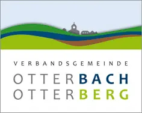

# Zwischenbericht September 2026

**Projekt „KI-Sprachmodelle in der kommunalen Verwaltung“ der Entwicklungsagentur Rheinland-Pfalz e.V.**

| | |
|---|---|
| Kommune | Verbandsgemeinde Otterbach-Otterberg |
| Berichtszeitraum | Juni – September 2026 |
| Vorstellung | 2. Oktober 2026, Bingen |
| Verfasser | Dominik Tröster, Digitalbeauftragter |

> **Die Ergebnisse sind reproduzierbar.** Alles, was für den Nachbau nötig ist – Installationsskripte, Einstellungen, der selbst entwickelte Auth-Proxy, Prüfaufträge und Testfälle –, steht in diesem Repository.

## Für wen ist was?

| Zielgruppe | Einstieg |
|---|---|
| **Verantwortliche in der Verwaltung** | Dieser Bericht: Ausgangslage, Vorgehen, Ergebnisse, Kosten, Erfahrungen und Empfehlungen |
| **IT-Fachleute** | [`setup/README.md`](../../setup/README.md): Schritt-für-Schritt-Installation auf einem eigenen Server |

## Inhalt

1. [Wie war der Stand zu Projektbeginn am 1. Juni 2026?](01-stand-projektbeginn.md)
2. [Was soll das Ergebnis im Februar 2027 sein?](02-ergebnis-februar-2027.md)
3. [Wie sollte aus damaliger Sicht der Stand im September 2026 sein?](03-soll-stand-september-2026.md)
4. [Wie ist der tatsächliche Stand im September 2026?](04-ist-stand-september-2026.md)
5. [Welche Arbeitspakete wurden bisher erledigt? Und wie wurde dabei vorgegangen?](05-arbeitspakete-und-vorgehen.md)
6. [Welche Stolpersteine traten auf?](06-stolpersteine.md)
7. [Was waren förderliche Faktoren?](07-foerderliche-faktoren.md)
8. [Was sollten andere Kommunen im Blick haben?](08-hinweise-fuer-kommunen.md)

Die Word-Fassung dieses Berichts wird aus denselben Dateien erzeugt (`tools/build-docx.sh`) und hängt am zugehörigen Release.
